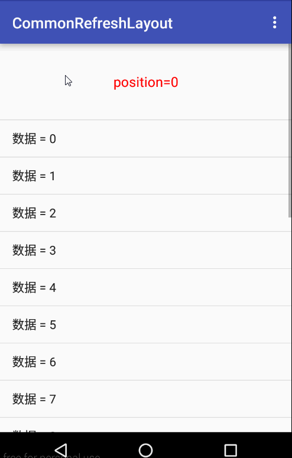

#### Android-CommonRefreshLayout
基于`SwipeRefreshLayout`下拉刷新、上拉加载。支持的`AbsListView`、`RecycleView`、`WebView`

####特点
 * 在布局`layout`中使用，支持`xml`属性
 * 支持自动下拉刷新，什么用呢？比如进入界面时，只需要调用`autoRefresh()`方法即可，显示上拉动画同时刷新回调`onRefresh`将会被调用
 * 上拉加载支持自定义`View`或设置加载文字、动画、加载完成
 * 轻松设置`Adapter`空数据视图，默认为`TextView`支持更文字，也可自定义`View`
 * 对于简单的界面，例如只有`ListView`可以继承 [SwipeRefreshListFragment](commonrefreshlayout/src/main/java/com/mylhyl/crlayout/app/SwipeRefreshListFragment.java)
   轻松搞定

####效果图


####使用
  仔细看`listSelector`属性，我们是支持的，效果见`sample`
```xml
    <com.mylhyl.crlayout.SwipeRefreshListView xmlns:android="http://schemas.android.com/apk/res/android"
        xmlns:crl="http://schemas.android.com/apk/res-auto"
        xmlns:tools="http://schemas.android.com/tools"
        android:id="@+id/swipeRefresh"
        android:layout_width="match_parent"
        android:layout_height="match_parent"
        android:listSelector="@drawable/selector_list"
        crl:load_text="数据正在加载中"
        crl:load_indeterminate_drawable="@drawable/footer_progressbar"
        tools:context=".app.ListViewFragment" />
```
 设置上拉加载，更多方法见 [LoadConfig](commonrefreshlayout/src/main/java/com/mylhyl/crlayout/internal/LoadConfig.java)
```java
        LoadConfig loadConfig = swipeRefreshListView.getLoadConfig();
        loadConfig.setLoadText("set自定义加载");
        loadConfig.setIndeterminateDrawable(getResources().getDrawable(R.drawable.footer_progressbar));
```
或 xml属性配置，更多属生见[attrs](commonrefreshlayout/src/main/res/values/attrs.xml)
```xml
            crl:load_text="数据正在加载中"
            crl:load_indeterminate_drawable="@drawable/footer_progressbar"
```

 自定义上拉加载
 
 * 方式一：代码配置
 
```java
        getSwipeRefreshLayout().setLoadLayoutResource(R.layout.swipe_refresh_footer);
```
 * 方式二：xml属性配置
 
```xml
        crl:load_layout="@layout/swipe_refresh_footer"
```
 * 方式三：继承重写`getLoadLayoutResource()`方法
 
```java
        public class MySwipeRefreshGridView extends SwipeRefreshGridView {
        
            @Override
            protected int getLoadLayoutResource() {
                return R.layout.swipe_refresh_footer;
            }
        }
```
设置adapter空数据视图文字
```java
        swipeRefreshListView.setEmptyText("数据呢？");
```
 自定义adapter空数据视图
```java
        ImageView emptyView = new ImageView(getContext());
        emptyView.setImageResource(R.mipmap.empty);
        swipeRefreshGridView.setEmptyView(emptyView);
```
注册`ListView`长按事件怎么办？好说好说提供了方法`getScrollView()`，既然能获取`ListView`那`SwipeRefreshLayout`是不是也可以获取到呢？答案是肯定的，方法`getSwipeRefreshLayout`，你可以随心所欲设置下拉圆圈的颜色、大小等。
关于更多公开方法见 [ISwipeRefresh](commonrefreshlayout/src/main/java/com/mylhyl/crlayout/internal/ISwipeRefresh.java)、[ILoadSwipeRefresh](commonrefreshlayout/src/main/java/com/mylhyl/crlayout/internal/ILoadSwipeRefresh.java)

#### 注意事项
`setLoadAnimator`、`setLoadLayoutResource`方法须在`setOnListLoadListener`之前调用 

#### 使用Gradle构建时添加一下依赖即可:
```javascript
compile 'com.mylhyl:commonrefreshlayout:2.4'
```
#### 如果使用eclipse
只能`clone`源码，然后在 eclipse 中用`library`方式引用
     
#### [下载APK体验](preview/sample-debug.apk)

#### 更新日志
> 2.4 修复第二次setAdapter崩溃的问题，修改已知BUG

> 2.1 修复空数据视图不显示

> 2.0 UI编辑支持预览

> 1.9 优化代码

> 1.8 优化加载更多显示效果

> 1.7 新增`setEnabled`禁用下拉刷新

> 1.6 新增加载完成，命名`footer`修改为`load`

> 1.5 优化`SwipeRefreshWebView`的`autoRefresh`方法

> 1.4 优化`SwipeRefreshWebView`显示下拉动画

> 1.3 增加`autoRefresh(@ColorRes int... colorResIds)`方法，指定动画颜色

> 1.2 修复滑动到底部会上拉加载多次

> 1.1 修改为`recyclerview-v7:23.4.0`

> 1.0 初始版本
